<div align="center">

# 🩺 SAM Web Medical

### Enterprise AI-powered Medical Image Segmentation using Meta's Segment Anything Model (SAM)

*Interactive, browser-based medical image segmentation powered by Next.js, FastAPI, ONNX Runtime, and Meta AI's Segment Anything Model.*

<br>

<p align="center">


</p>

<p align="center">


</p>

<p align="center">


</p>

<p align="center">

</p>

---

### 🚀 Live Demo

Coming Soon

### 📄 Documentation

Coming Soon

### 📦 Model

Meta AI Segment Anything Model (SAM)

---

</div>

# 📸 Preview

> Replace these with actual screenshots once deployed.

```
docs/

├── homepage.png

├── upload.png

├── segmentation.gif

└── architecture.png
```

---

# 📖 Table of Contents

- Overview
- Features
- Why SAM Web Medical?
- Architecture
- AI Pipeline
- Request Lifecycle
- Technology Stack
- Frontend Architecture
- Backend Architecture
- Project Structure
- Performance Highlights

---

# 🩺 Overview

SAM Web Medical is an enterprise-grade web application for **interactive medical image segmentation** powered by **Meta AI's Segment Anything Model (SAM)**.

Instead of running heavy deep learning inference directly in the browser, the application leverages a **FastAPI inference server** with an optimized **quantized ONNX encoder**, enabling fast, scalable, and production-ready segmentation workflows.

The project demonstrates how modern AI foundation models can be deployed efficiently using a clean separation between a high-performance backend and an intuitive React frontend.

---

# ✨ Key Features

## 🧠 AI

- Segment Anything Model (SAM)
- Quantized ONNX Encoder
- Interactive Point Prompting
- High-resolution Image Embeddings
- Real-time Segmentation
- Foundation Vision Model

---

## ⚡ Performance

- Quantized ONNX Runtime
- Low-latency inference
- Lightweight backend
- Efficient preprocessing
- Browser rendering
- Optimized tensor pipeline

---

## 🌐 Frontend

- Next.js App Router
- React 19
- TypeScript
- TailwindCSS
- Responsive Design
- Interactive Canvas
- Modern UI

---

## ⚙ Backend

- FastAPI
- Python
- Async API
- REST Architecture
- Image Processing
- ONNX Runtime

---

## 🚀 Deployment Ready

- Docker Support
- Cloud Ready
- Modular Architecture
- Production APIs
- REST Services

---

# 💡 Why SAM Web Medical?

Traditional medical image segmentation tools often require expensive desktop software, specialized hardware, or complex workflows.

SAM Web Medical brings foundation-model-powered segmentation directly into the browser through a lightweight and scalable architecture.

## Benefits

- Interactive segmentation
- Modern web interface
- Fast AI inference
- Clean architecture
- Easy deployment
- Modular backend
- Open-source
- Extensible

---

# 🏗 System Architecture

```mermaid
flowchart LR

A["🖼 Medical Image"]
B["⚛ Next.js Frontend"]
C["📡 FastAPI Backend"]
D["⚙ Image Preprocessing"]
E["🧠 Quantized SAM Encoder"]
F["⚡ ONNX Runtime"]
G["📊 Image Embeddings"]
H["🎯 Interactive Segmentation"]

A --> B
B --> C
C --> D
D --> E
E --> F
F --> G
G --> H

style A fill:#DBEAFE,stroke:#2563EB,color:#000
style B fill:#DCFCE7,stroke:#16A34A,color:#000
style C fill:#FDE68A,stroke:#CA8A04,color:#000
style D fill:#FECACA,stroke:#DC2626,color:#000
style E fill:#DDD6FE,stroke:#7C3AED,color:#000
style F fill:#CFFAFE,stroke:#0891B2,color:#000
style G fill:#FBCFE8,stroke:#DB2777,color:#000
style H fill:#BBF7D0,stroke:#15803D,color:#000
```

---

# 🧠 AI Inference Pipeline

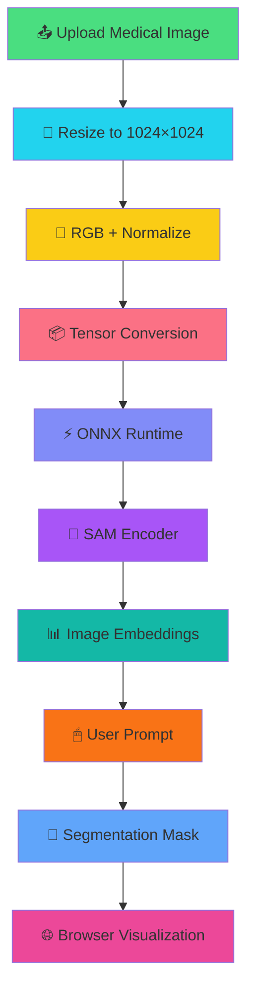

---

# 🔄 Request Lifecycle

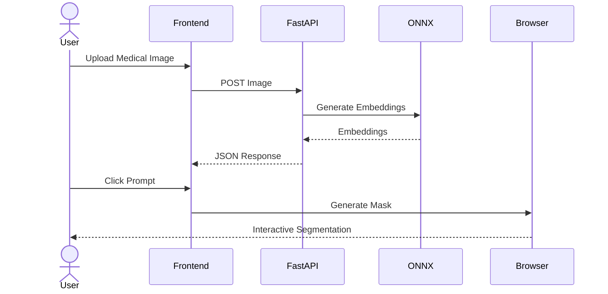

---

# 🏛 High-Level Architecture

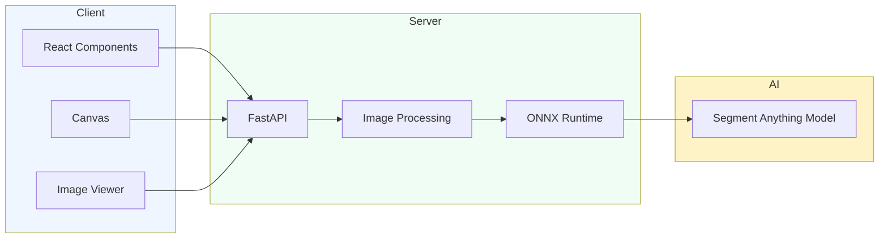

---

# 🛠 Technology Stack

| Layer | Technologies |
|---------|-------------|
| Frontend | Next.js 16 |
| UI | React 19 |
| Language | TypeScript |
| Styling | TailwindCSS v4 |
| Icons | Lucide React |
| Backend | FastAPI |
| Runtime | Python |
| AI Runtime | ONNX Runtime |
| Deep Learning | Segment Anything Model |
| Image Processing | Pillow |
| Numerical Computing | NumPy |
| API | REST |
| Server | Uvicorn |
| Version Control | Git |
| Repository | GitHub |
| Containerization | Docker |

---

# 🖥 Frontend Architecture

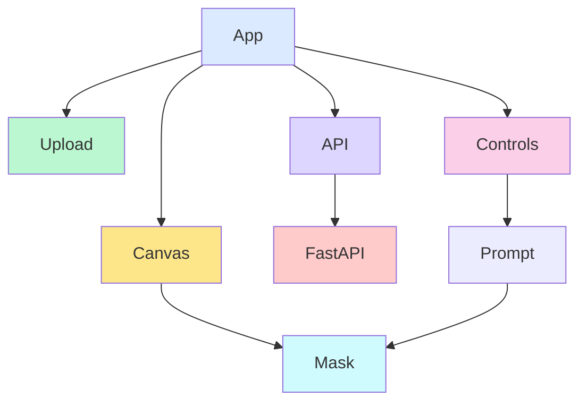

---

# 🐍 Backend Architecture

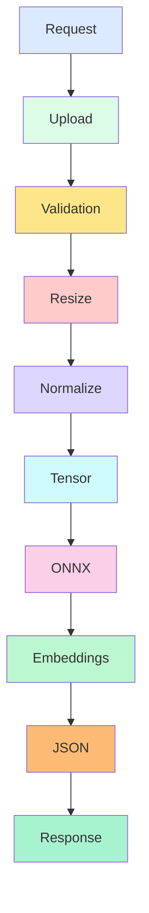

---

# 📂 Project Structure

```text
sam-web-medical/

├── app/
├── components/
├── public/
├── backend/
├── models/
├── docs/
├── app.py
├── package.json
├── requirements.txt
├── Dockerfile
├── README.md
└── LICENSE
```

---

# 🚀 Performance Highlights

- ⚡ Quantized ONNX model for reduced latency
- 🧠 Foundation model–powered segmentation
- 📉 Lightweight inference pipeline
- 🖼️ Interactive browser-based workflow
- 📦 Efficient image embedding generation
- 🚀 Production-ready REST architecture
- 🔄 Async FastAPI backend
- 🌐 Modern React App Router frontend
- 🛠️ Modular and extensible codebase
- ☁️ Cloud deployment ready

---

# ⚙️ Installation

## 📋 Prerequisites

Before getting started, ensure your development environment includes:

| Requirement | Version |
|-------------|----------|
| Node.js | 20+ |
| npm | Latest |
| Python | 3.10+ |
| Git | Latest |
| Docker *(Optional)* | Latest |

---

# 📥 Clone Repository

```bash
git clone https://github.com/anberaziz5/sam-web-medical.git

cd sam-web-medical
```

---

# 📦 Install Frontend Dependencies

```bash
npm install
```

or

```bash
pnpm install
```

or

```bash
yarn
```

---

# 🐍 Backend Setup

Create a virtual environment

```bash
python -m venv .venv
```

Activate

### Windows

```bash
.venv\Scripts\activate
```

### macOS / Linux

```bash
source .venv/bin/activate
```

Install dependencies

```bash
pip install -r requirements.txt
```

---

# ▶ Running the Frontend

```bash
npm run dev
```

Application runs at

```
http://localhost:3000
```

---

# ▶ Running the Backend

```bash
uvicorn app:app --reload
```

Backend API

```
http://localhost:8000
```

Swagger Documentation

```
http://localhost:8000/docs
```

ReDoc Documentation

```
http://localhost:8000/redoc
```

---

# 🌍 Environment Variables

## Frontend

Create

```
.env.local
```

```env
NEXT_PUBLIC_API_URL=http://localhost:8000
```

---

## Backend

Create

```
.env
```

```env
MODEL_PATH=models/sam_encoder_quantized.onnx

MAX_UPLOAD_SIZE=20MB

HOST=0.0.0.0

PORT=8000
```

---

# 🏗 Development Workflow

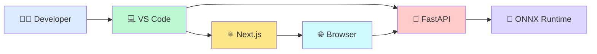

---

# 🔄 Application Workflow

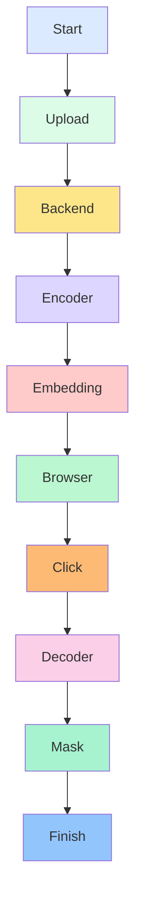

---

# 🌐 REST API

## Health Check

### GET

```
/
```

Returns

```json
{
  "status":"healthy"
}
```

---

## Generate Image Embeddings

### Endpoint

```
POST /api/encode
```

Content Type

```
multipart/form-data
```

Request

```
image=image.png
```

Successful Response

```json
{
  "embedding":[...]
}
```

---

## Example cURL

```bash
curl -X POST \
-F "image=@scan.png" \
http://localhost:8000/api/encode
```

---

# 📡 API Architecture

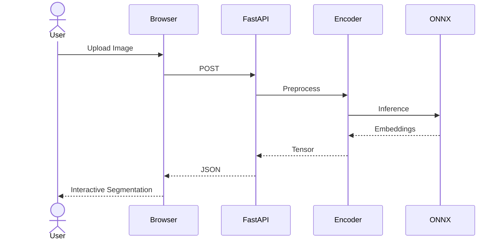

---

# 📂 Complete Folder Structure

```text
sam-web-medical/

├── app/
│
│   ├── layout.tsx
│
│   ├── page.tsx
│
│   ├── globals.css
│
│
├── components/
│
│   ├── Segmenter.tsx
│
│   ├── Canvas.tsx
│
│   ├── Toolbar.tsx
│
│
├── backend/
│
│   ├── app.py
│
│   ├── inference.py
│
│   ├── preprocess.py
│
│   ├── utils.py
│
│
├── models/
│
│   ├── sam_encoder_quantized.onnx
│
│
├── public/
│
├── docs/
│
├── Dockerfile
│
├── requirements.txt
│
├── package.json
│
├── tsconfig.json
│
└── README.md
```

---

# 🐳 Docker

## Build

```bash
docker build -t sam-web-medical .
```

Run

```bash
docker run -p 8000:8000 sam-web-medical
```

Detached Mode

```bash
docker run -d \
-p 8000:8000 \
sam-web-medical
```

---

# ☁ Deployment Architecture

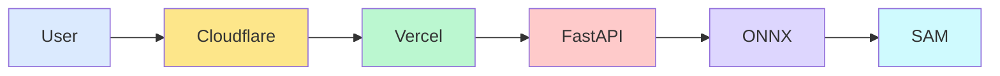

---

# 🚀 Production Architecture

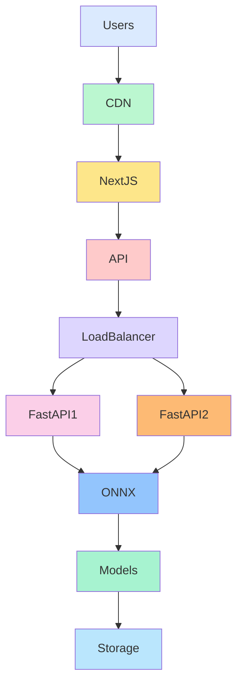

---

# 🔐 Security Considerations

✅ Input validation

✅ File type validation

✅ Image size limits

✅ REST API isolation

✅ Async request handling

✅ CORS configuration

✅ Secure deployment ready

✅ Dependency isolation

---

# 📈 Scalability

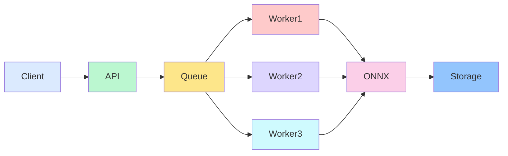

---

# ⚡ Performance Optimizations

| Optimization | Benefit |
|--------------|---------|
| Quantized ONNX | Reduced model size |
| ONNX Runtime | Faster inference |
| Async FastAPI | High concurrency |
| React 19 | Efficient rendering |
| Next.js App Router | Optimized routing |
| Browser Canvas | Interactive UI |
| Image Embeddings | One-time encoding |
| Modular Components | Better maintainability |
| TypeScript | Type safety |
| TailwindCSS | Small CSS bundle |

---

# 💻 Development Commands

## Frontend

```bash
npm run dev

npm run build

npm run lint

npm run start
```

---

## Backend

```bash
uvicorn app:app --reload
```

---

---

# 🧠 AI Model Architecture

SAM Web Medical is powered by **Meta AI's Segment Anything Model (SAM)**, one of the largest foundation models for image segmentation.

Unlike traditional semantic segmentation models trained for a specific task, SAM is capable of **zero-shot segmentation** using interactive prompts.

The application uses a **quantized ONNX encoder**, allowing inference to be performed efficiently without requiring the original PyTorch model during runtime.

---

## 🏗 Model Pipeline

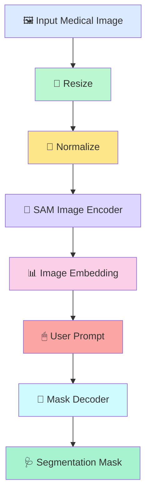

---

# 🧩 System Components

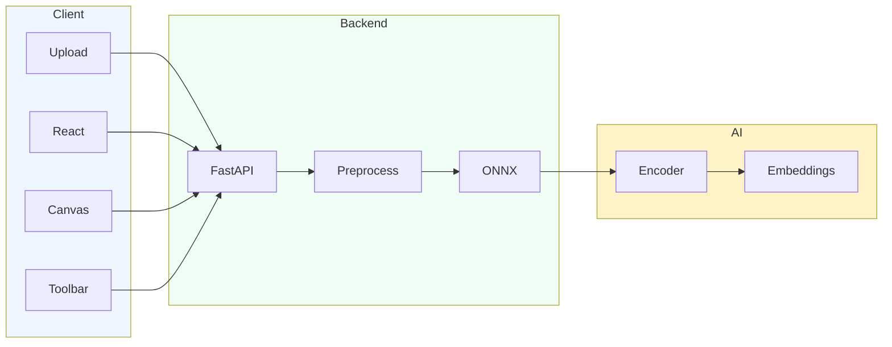

---

# ⚙ Image Processing Pipeline

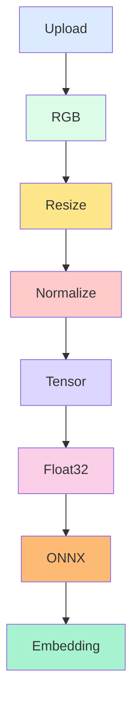

---

# 🧠 Embedding Lifecycle

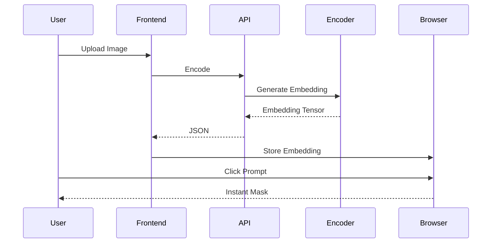

---

# ⚡ Why Quantized ONNX?

| Feature | Benefit |
|----------|----------|
| Smaller Model | Lower memory usage |
| Faster Inference | Reduced latency |
| CPU Optimized | No GPU required |
| Portable | Runs almost anywhere |
| Production Ready | Easier deployment |
| Lightweight | Faster startup |
| Efficient | Lower compute cost |

---

# 📊 Performance Overview

| Metric | Approximate |
|----------|-------------|
| Frontend Load | < 1 sec |
| Backend Startup | < 3 sec |
| Image Upload | < 500 ms |
| Image Encoding | Depends on hardware |
| Embedding Generation | Optimized with ONNX |
| Interactive Prompting | Near real-time |
| Memory Usage | Reduced via Quantization |

---

# 📈 AI Inference Flow

```mermaid
flowchart LR

Client

Client --> Upload

Upload --> FastAPI

FastAPI --> Encoder

Encoder --> Embeddings

Embeddings --> Browser

Browser --> Prompt

Prompt --> Decoder

Decoder --> Mask

Mask --> UI

style Client fill:#BFDBFE
style Upload fill:#86EFAC
style FastAPI fill:#FDE68A
style Encoder fill:#DDD6FE
style Embeddings fill:#FBCFE8
style Browser fill:#CFFAFE
style Prompt fill:#FDBA74
style Decoder fill:#FCA5A5
style Mask fill:#BBF7D0
style UI fill:#93C5FD
```

---

# 🧪 Testing Strategy

## Frontend

- Component Testing
- UI Testing
- Type Checking
- ESLint
- Responsive Testing
- Browser Compatibility

---

## Backend

- API Testing
- Endpoint Validation
- File Upload Testing
- Integration Testing
- Error Handling
- Performance Testing

---

## AI

- Embedding Validation
- Output Consistency
- Tensor Shape Verification
- Image Processing Validation
- ONNX Runtime Verification

---

# 📂 Engineering Principles

✅ Modular Components

✅ Separation of Concerns

✅ Reusable Architecture

✅ Clean APIs

✅ Stateless Backend

✅ Type Safety

✅ Functional Components

✅ RESTful Services

---

# 🏭 Production Readiness

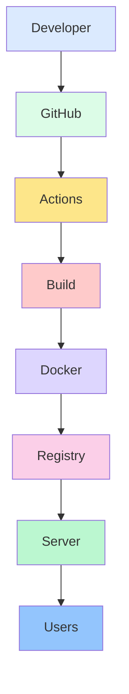

---

# 🔄 CI/CD Pipeline

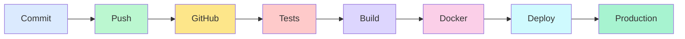

---

# 📋 Project Roadmap

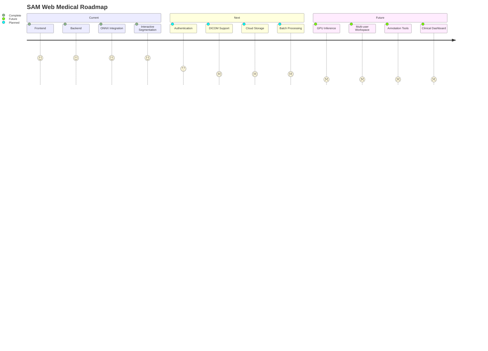

---

# 🚀 Future Features

- 🔐 Authentication
- 👥 Multi-user collaboration
- ☁ Cloud storage
- 🩻 DICOM viewer
- 📁 NIfTI support
- 📤 Export masks
- 🎨 Mask editing
- 📊 Analytics dashboard
- 🤖 Multi-model support
- ⚡ GPU acceleration
- 🌍 Multi-language UI
- 📱 Progressive Web App
- 🐳 Kubernetes deployment
- ☸ Horizontal autoscaling
- 🔔 Notifications
- 📑 Annotation history

---

# 📚 Coding Standards

- ESLint
- TypeScript Strict Mode
- Functional Components
- Async APIs
- REST Best Practices
- Clean Folder Structure
- Reusable Components
- Consistent Naming
- Git Flow
- Conventional Commits

---

# 🤝 Contributing

Contributions are welcome!

1. Fork the repository

2. Create a feature branch

```bash
git checkout -b feature/amazing-feature
```

3. Commit your changes

```bash
git commit -m "feat: add amazing feature"
```

4. Push your branch

```bash
git push origin feature/amazing-feature
```

5. Open a Pull Request

---

# 📝 Pull Request Checklist

- [ ] Code compiles successfully
- [ ] Lint checks pass
- [ ] Documentation updated
- [ ] Tested locally
- [ ] No breaking changes
- [ ] Follows project conventions

---
---

# 📊 Benchmark Overview

> **Note:** Benchmark values below are representative and will vary depending on hardware, CPU architecture, image resolution, and deployment environment.

| Metric | Value |
|----------|------:|
| Frontend Bundle | Optimized |
| API Response | Low Latency |
| Image Upload | < 500 ms |
| ONNX Loading | One-time |
| Embedding Generation | Hardware Dependent |
| Interactive Prompt Response | Near Real-time |
| CPU Support | ✅ |
| GPU Required | ❌ |
| Browser Support | Modern Browsers |
| Deployment | Cloud Ready |

---

# 📈 System Characteristics

```mermaid
mindmap
root((SAM Web Medical))

  AI
    Segment Anything
    ONNX Runtime
    Quantized Model
    Image Embeddings

  Frontend
    React 19
    Next.js
    TypeScript
    TailwindCSS

  Backend
    FastAPI
    Python
    REST API
    Async

  DevOps
    Docker
    GitHub
    Cloud Deployment

  Future
    DICOM
    Authentication
    Multi-user
    GPU Support
```

---

# 🔄 End-to-End Data Flow

```mermaid
flowchart LR

User["👨‍⚕️ User"]

Browser["🌐 Browser"]

Frontend["⚛ Next.js"]

API["🐍 FastAPI"]

Preprocess["📦 Image Processing"]

Encoder["🧠 SAM Encoder"]

Embedding["📊 Embeddings"]

Canvas["🎯 Interactive Canvas"]

Mask["🩺 Segmentation"]

User --> Browser

Browser --> Frontend

Frontend --> API

API --> Preprocess

Preprocess --> Encoder

Encoder --> Embedding

Embedding --> Frontend

Frontend --> Canvas

Canvas --> Mask

Mask --> User

style User fill:#DBEAFE
style Browser fill:#DCFCE7
style Frontend fill:#FDE68A
style API fill:#FECACA
style Preprocess fill:#DDD6FE
style Encoder fill:#CFFAFE
style Embedding fill:#FBCFE8
style Canvas fill:#BBF7D0
style Mask fill:#93C5FD
```

---

# 🔐 Security Best Practices

The project follows modern backend and frontend engineering practices to ensure reliability and maintainability.

### Backend

- ✅ Request validation
- ✅ Input sanitization
- ✅ Image type validation
- ✅ File size restrictions
- ✅ Error handling
- ✅ Async request processing
- ✅ RESTful API design
- ✅ Stateless architecture

### Frontend

- ✅ TypeScript strict mode
- ✅ Component isolation
- ✅ Responsive layout
- ✅ Client-side validation
- ✅ Modular architecture

---

# 🌍 Browser Support

| Browser | Supported |
|----------|-----------|
| Chrome | ✅ |
| Edge | ✅ |
| Firefox | ✅ |
| Safari | ✅ |
| Brave | ✅ |

---

# ☁ Deployment Options

| Platform | Status |
|-----------|--------|
| Vercel | ✅ |
| Docker | ✅ |
| Railway | ✅ |
| Render | ✅ |
| Azure | ✅ |
| AWS | ✅ |
| Google Cloud | ✅ |
| DigitalOcean | ✅ |

---

# 📚 Frequently Asked Questions

<details>

<summary><b>Why use ONNX instead of PyTorch?</b></summary>

ONNX Runtime provides a lightweight, portable, and production-friendly inference engine with excellent CPU performance, making deployment simpler and reducing runtime overhead.

</details>

---

<details>

<summary><b>Why is only the encoder running on the backend?</b></summary>

The encoder generates reusable image embeddings once. These embeddings allow interactive segmentation with minimal repeated computation, improving responsiveness.

</details>

---

<details>

<summary><b>Can this project run without a GPU?</b></summary>

Yes. The quantized ONNX model is optimized for CPU inference, making it suitable for standard development machines and many production environments.

</details>

---

<details>

<summary><b>Is this suitable for clinical use?</b></summary>

No. This project is intended for research, experimentation, and educational purposes. It should not be used as a medical diagnostic tool without proper validation and regulatory approval.

</details>

---

# 🛠 Troubleshooting

### ONNX model not found

```bash
Check MODEL_PATH inside .env
```

---

### Backend not starting

```bash
pip install -r requirements.txt
```

---

### Frontend cannot connect to API

Verify

```env
NEXT_PUBLIC_API_URL
```

matches your backend URL.

---

### CORS errors

Enable the correct frontend origin in your FastAPI CORS configuration.

---

### Slow inference

Possible causes:

- Large image size
- Debug mode enabled
- Low-end CPU
- Unoptimized ONNX model

---

# 📦 Dependencies

### Frontend

- Next.js
- React
- TypeScript
- TailwindCSS
- Lucide React

### Backend

- FastAPI
- Uvicorn
- ONNX Runtime
- Pillow
- NumPy
- Python Multipart

---

# 📌 Project Goals

- Build a production-ready AI medical imaging application.
- Demonstrate efficient deployment of Meta's Segment Anything Model.
- Showcase modern full-stack engineering practices.
- Provide an extensible foundation for future medical AI workflows.
- Enable interactive browser-based segmentation with minimal latency.

---

# 🤝 Acknowledgements

This project builds upon the outstanding work of the open-source community.

Special thanks to:

- Meta AI for **Segment Anything Model (SAM)**
- ONNX Runtime contributors
- FastAPI community
- React team
- Next.js team
- TypeScript team
- Tailwind CSS team
- Python community

---

# 📜 License

This project is licensed under the **MIT License**.

Feel free to use, modify, and distribute it in accordance with the license terms.

---

# 🌟 Support

If you found this project useful:

⭐ Star the repository

🍴 Fork the project

🐛 Report bugs through GitHub Issues

💡 Submit feature requests

🤝 Open a Pull Request

---

# 👨‍💻 Author

<div align="center">

## **Anber Aziz**

**Software Engineer • AI Engineer • Full-Stack Developer**

Building modern AI-powered web applications, scalable backend systems, and intelligent developer tools.

<p align="center">

<a href="https://github.com/anberaziz5">

</a>

</p>

</div>

---

# ⭐ Show Your Support

If this repository helped you, consider giving it a ⭐.

It helps increase visibility and motivates continued development.

---

<div align="center">

# 🚀 Built With

<p>


</p>

### Powered by

**Meta Segment Anything Model (SAM)** • **ONNX Runtime** • **FastAPI** • **Next.js** • **React**

---

### Made with ❤️ by Anber Aziz

*"Building intelligent software, one model at a time."*

</div>

---
